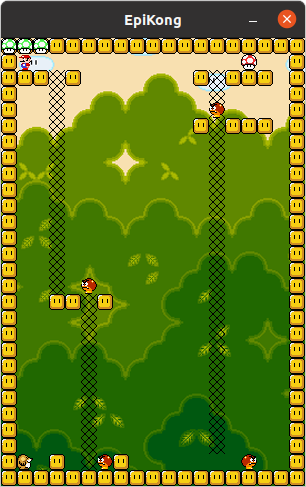

# Epikong

Project from second year in Epitech, made in 2 days C with 2 other students using the [SDL](https://www.libsdl.org/)

## Installation

⚠️ SDL 1.2 is not compatible on new version on MacOS

1. Install the SDL
2. Run `make`
3. Launch project `./epikong`

## How to play

You control mario using keyboard's arrows and jump `space`. You can pick up items with `enter`.

Your goal is to get the red mushroom and to give it back to the mole in each of the 5 levels.

## Screenshots

