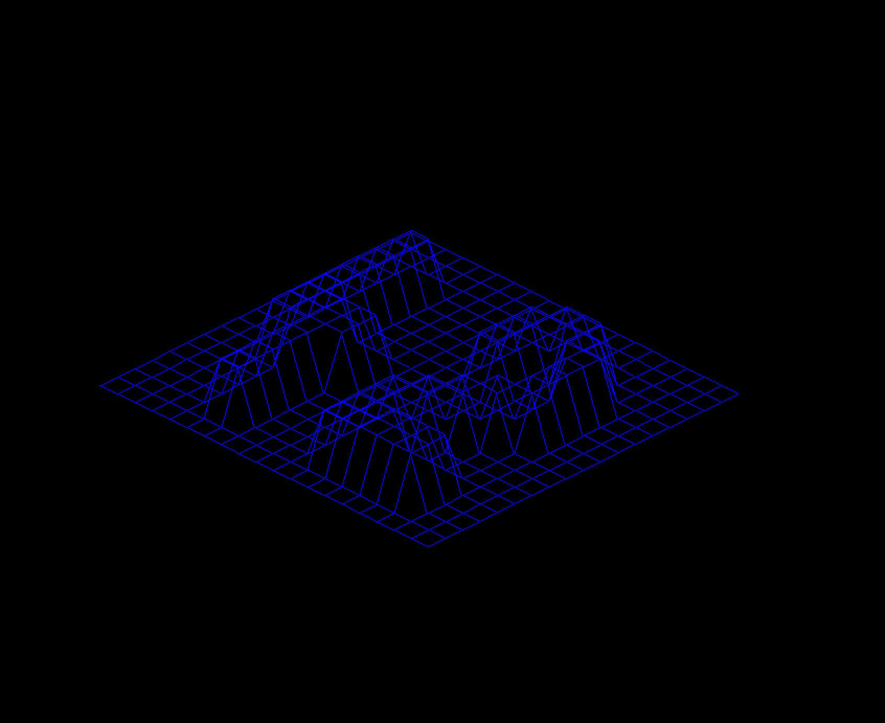
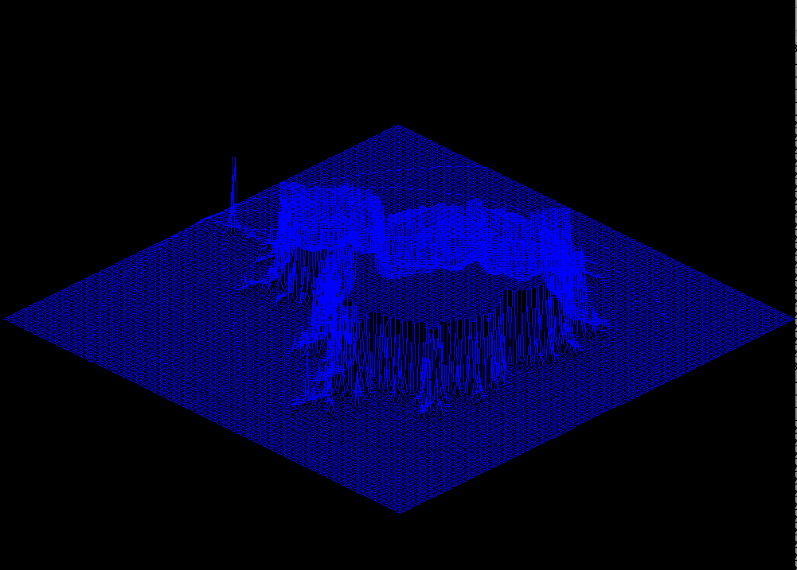

# FDF - Fil de fer

Project from first year in Epitech, made in C using the [MinilibX](https://github.com/42Paris/minilibx-linux)

## Installation

### MacOS

1. Install the [MinilibX](https://github.com/42Paris/minilibx-linux) to `/usr/X11/`
2. Run `make`
3. Launch project with input file `./fdf inputs/input1.fdf`

## Screenshots

