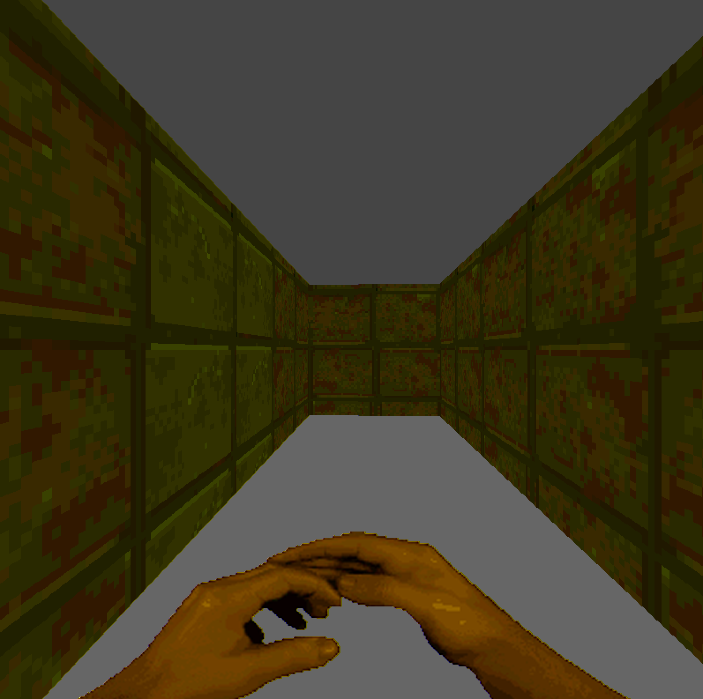
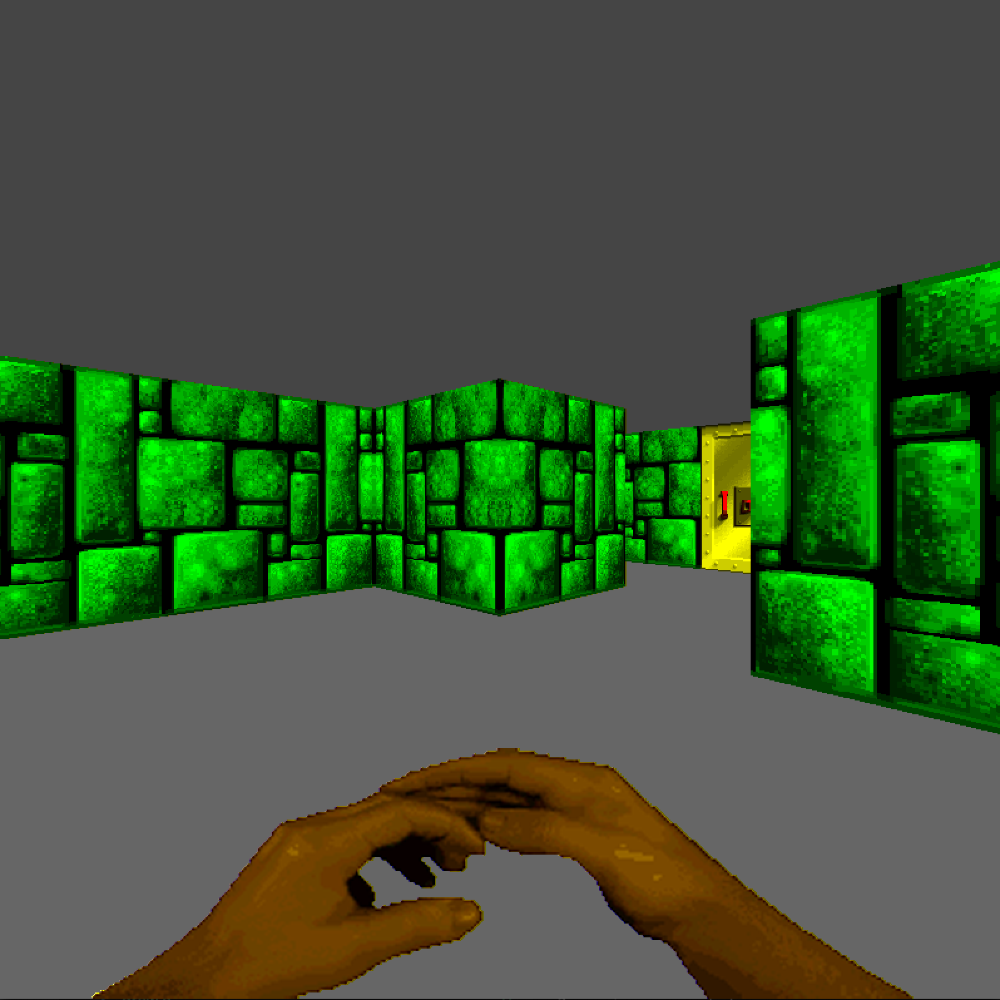
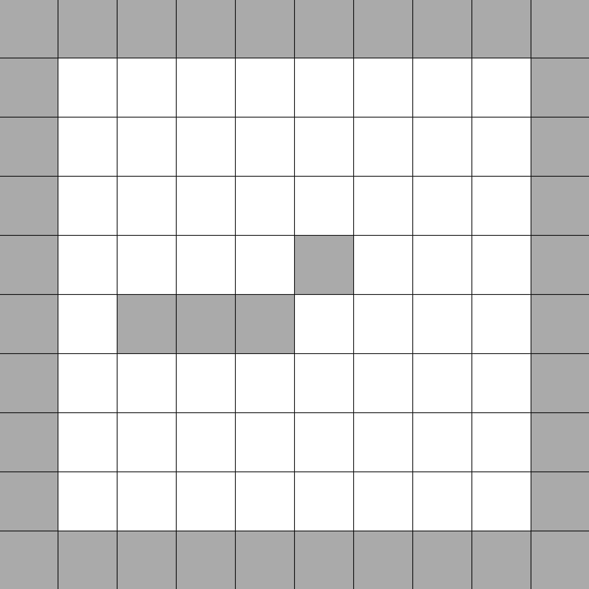

# Wolf3D

Project from first year in Epitech, made in C using the [MinilibX](https://github.com/42Paris/minilibx-linux)

## Installation

### MacOS

1. Install the [MinilibX](https://github.com/42Paris/minilibx-linux) to `/usr/X11/`
2. Run `make`
3. Launch project `./wolf3d`

## Screenshots

(colors were not like this, probably an issue on MacOS)

### game

### map editor

